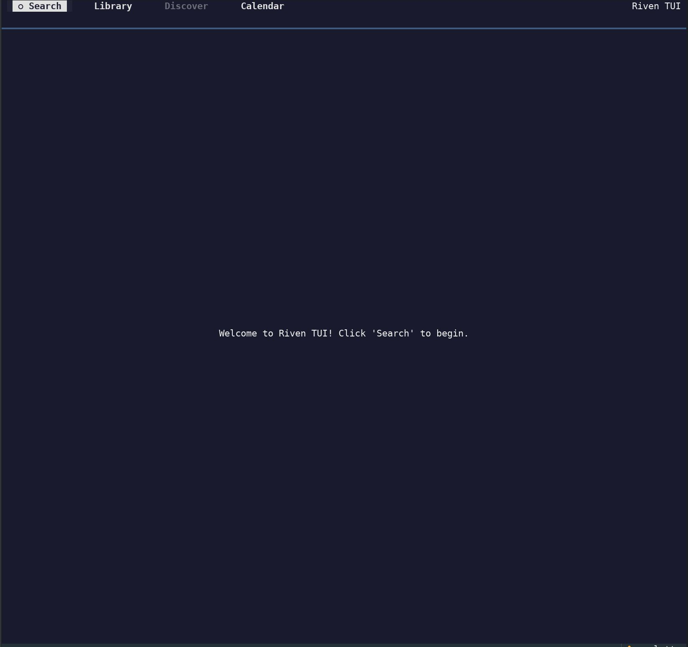

# A Riven TUI

A modern, terminal-based user interface for managing your **Riven** library. Built with Python and the Textual framework.

## 📸 Screenshots

| Main Application | Search View |
| :---: | :---: |
|  |  |
| **Library View** | **Calendar** |
|  |  |

## 🚀 Features

-   **Library Browsing:** View and filter your existing movies and TV shows.
-   **TMDB Integration:** Search for new content directly from TMDB.
-   **Manual Scraping:** Robust flow for discovering streams, selecting torrents, and mapping files to seasons/episodes.
-   **Release Calendar:** A monthly view of released and upcoming content with category filters.
-   **Settings Management:** Dynamically generated configuration interface driven by the Riven backend schema. Support for nested structures, dropdowns, and multi-line list editing.
-   **Poster Art:** High-quality terminal image rendering using `chafa`.
-   **Live Logs:** View and refresh Riven backend logs directly within the app.

## 📋 Requirements

-   **Python:** 3.12 or higher.
-   **Riven Backend:** A running instance of Riven.
-   **Terminal:** A modern terminal with Unicode support (and truecolor for best results).
-   **System Tools:** `chafa` (Optional, required for poster display).

## 🛠️ Installation

1.  **Clone the repository:**
    ```bash
    git clone https://github.com/subvhome/riven-tui.git
    cd riven-tui
    ```

2.  **Set up a virtual environment:**
    ```bash
    python -m venv .venv
    source .venv/bin/activate
    ```

3.  **Install dependencies:**
    ```bash
    pip install -r requirements.txt
    ```

## ⚙️ Configuration

1.  Copy the example settings file:
    ```bash
    cp settings.json.example settings.json
    ```
2.  Edit `settings.json` with your specific details:
    -   `be_config`: Your Riven backend URL and port.
    -   `api_key`: Your Riven API key.
    -   `tmdb_bearer_token`: Your TMDB API Read Access Token.

## 🎮 Usage

Start the application using:
```bash
python riven_tui.py
```

### Key Bindings & Navigation
-   **Tab / Arrow Keys:** Navigate between UI elements.
-   **Enter:** Select items or submit searches.
-   **Search:** Use the header button to search TMDB.
-   **Library:** Filter and browse your Riven collection.
-   **Calendar:** View releases by month; use the sidebar to jump to specific dates.
-   **Settings:** Access and modify your Riven configuration with partial update support.

## 📜 License

Distributed under the MIT License. See `LICENSE` for more information.