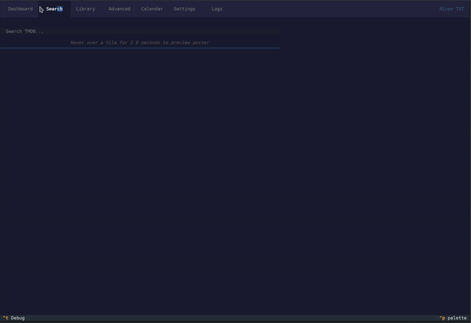
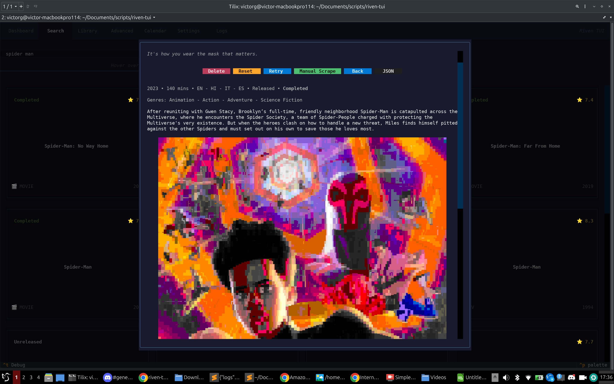
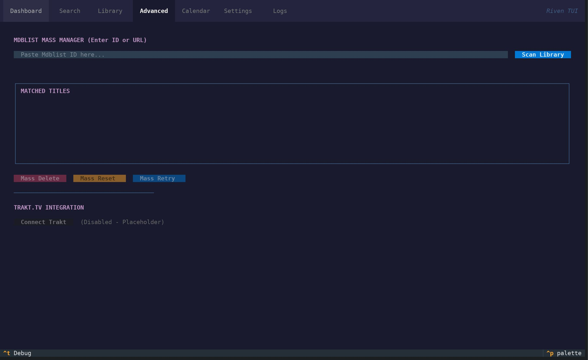
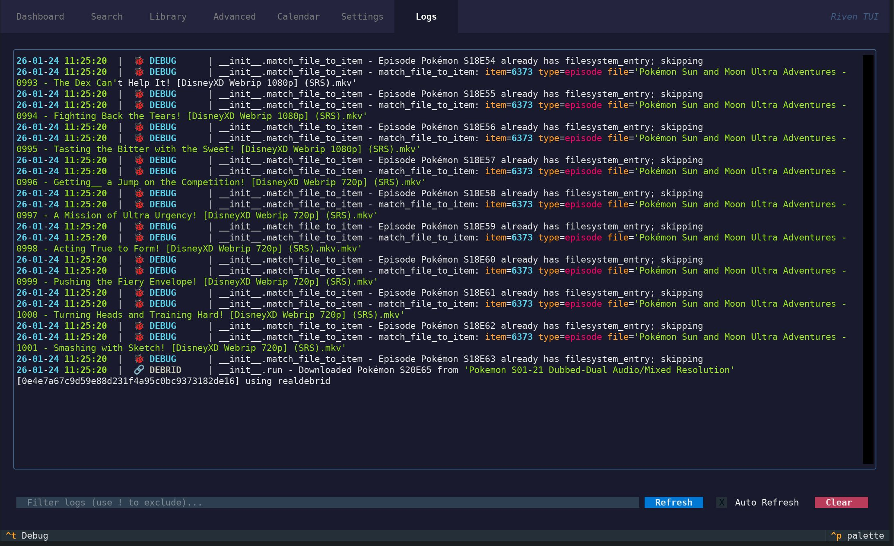
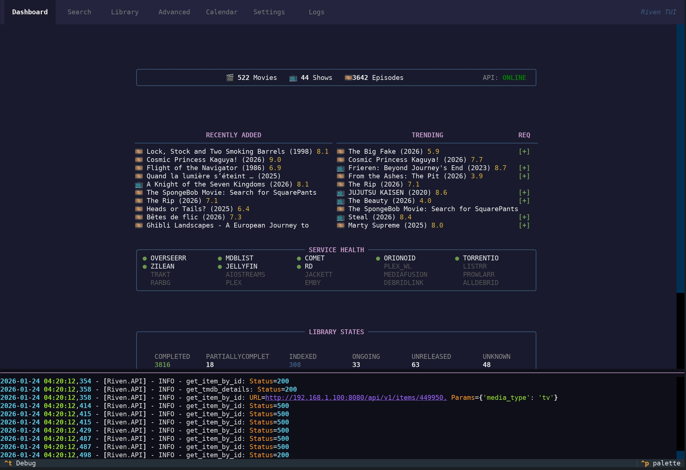

# Riven TUI

A high-performance terminal-based alternative to the Riven Web interface. 

Riven TUI turns your shell into a dedicated media kiosk, allowing you to discover, request, and monitor your entire collection with the speed and efficiency of a native terminal application.

<p align="center">
  
</p>

## Features & Capabilities

- **Complete Web UI Replacement**: Manage your Riven lifecycle entirely from the terminal. Monitor server health, library statistics, and collection distribution at a glance.
- **Frictionless Media Requesting**: A streamlined "Media Wall" powered by TMDB. Use the quick-add `[+]` button on trending items or deeper metadata cards to get content into your system instantly.
- **Real-Time Library Governance**: Deep cross-referencing between TMDB and your Riven backend. Items are color-coded and badged by their current pipeline state (e.g., *Completed, Indexed, Scraped*).
- **Integrated Maintenance Suite**: Power tools for collection cleanup. Multi-select items across your library to perform batch **Reset, Retry, Remove, Pause,** or **Unpause** tasks with safety confirmations.
- **Transparent Troubleshooting**: A dedicated full-screen log viewer with keyword filtering and a secure, redacted debug overlay (`Ctrl+T`) for real-time technical monitoring.
- ~~**Manual Scrape Workflow**: Surgical stream discovery and file-to-episode mapping directly within the TUI.~~ *(Temporarily disabled for backend stabilization)*
- **Native Visual Experience**: High-resolution poster rendering using `chafa` and a fully localized calendar view for tracking upcoming releases.

## Installation

```bash
curl -sSL https://raw.githubusercontent.com/subvhome/riven-tui/main/install.sh | bash
```

### Manual Setup
1. `git clone https://github.com/subvhome/riven-tui.git`
2. `pip install -r requirements.txt`
3. `cp settings.json.example settings.json`
4. `python riven_tui.py`

## Screenshots

| Dashboard | Library |
| :---: | :---: |
|  |  |

| Search | Media Detail |
| :---: | :---: |
|  |  |

| Calendar | Advanced |
| :---: | :---: |
|  |  |

| Logs | Debug Window |
| :---: | :---: |
|  |  |

## Configuration

Settings can be managed in `settings.json` or via the interactive in-app **Settings Tree**:

- `riven_key`: Your Riven API key.
- `tmdb_bearer_token`: TMDB Read Access Token for discovery.
- `be_config`: Connection details for your Riven backend.
- `api_url_overrides`: Granular control over specific API endpoint paths.
- `chafa_max_width`: Maximum width for rendered media posters.

---
Built with [Textual](https://github.com/Textualize/textual).
