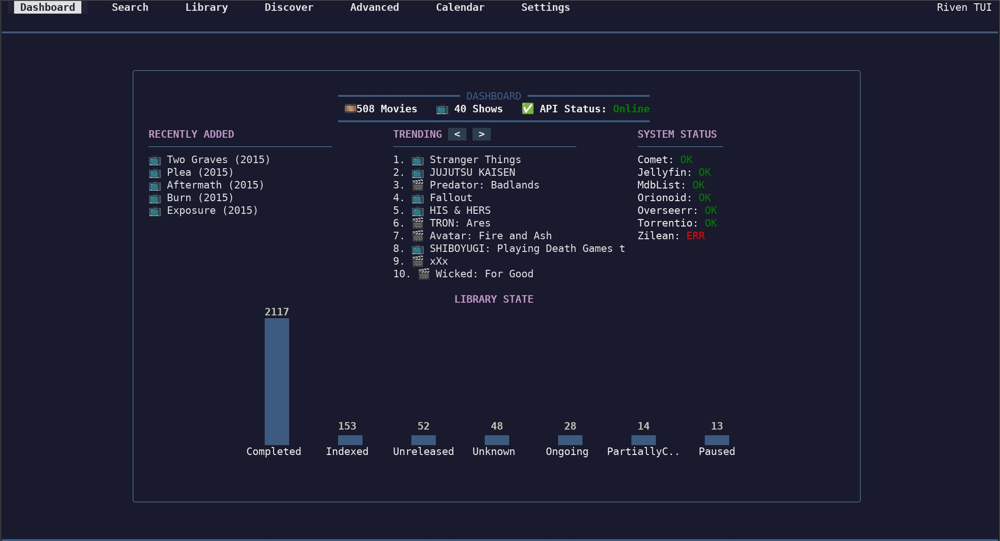
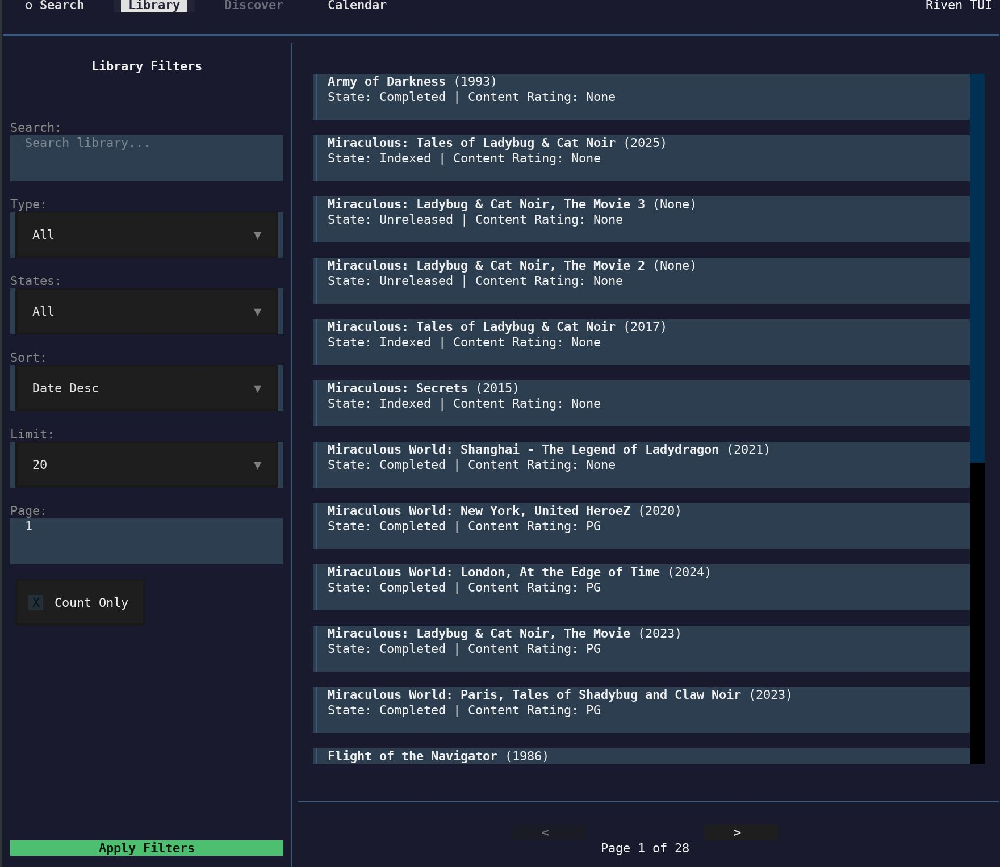
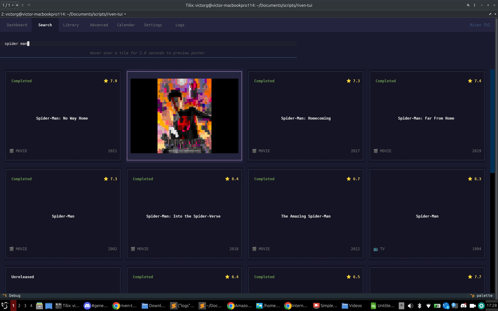
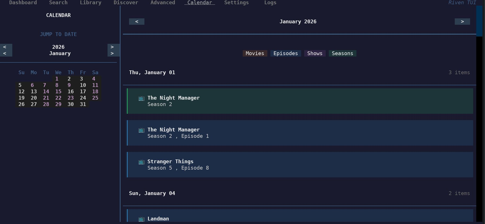

# Riven TUI

A terminal-based management interface for [Riven](https://github.com/rivenmedia/riven). 

Built for those who prefer staying in the shell, this TUI provides a visual way to monitor your library, discover new content, and handle manual scrapes without opening a browser.



## What's inside

- **Central Dashboard**: A single view for library statistics (movies/shows), system health, and a feed of recently added media.
- **Library Analytics**: Custom Unicode-based bar charts for tracking your library state distribution.
- **Discovery**: Integrated [TMDB](https://www.themoviedb.org/) trending lists with a "Quick Add" feature to send content to Riven instantly.
- **Advanced Management**: Mass-action suite for library maintenance. Scan external lists (like [Mdblist](https://mdblist.com/)) and bulk Delete, Reset, or Retry items in your library.
- **Manual Scraping**: A full workflow for stream discovery, torrent selection, and file-to-episode mapping.
- **Posters & Visuals**: High-resolution poster rendering using [chafa](https://hpjansson.org/chafa/).
- **Live Logs**: Integrated log viewer for the Riven backend.

## Installation

The easiest way to get set up is the interactive install script. It handles the virtual environment, dependencies, and guides you through the initial configuration.

```bash
curl -sSL https://raw.githubusercontent.com/subvhome/riven-tui/main/install.sh | bash
```

### Manual Setup
1. Clone the repo: `git clone https://github.com/subvhome/riven-tui.git`
2. Create a venv and install requirements: `pip install -r requirements.txt`
3. Initialize settings: `cp settings.json.example settings.json`
4. Run: `python riven_tui.py`

## Screenshots

| Library | Search |
| :---: | :---: |
|  |  |

| Calendar |
| :---: |
|  |

## ⚙️ Advanced Features

### Mass List Management
The Advanced tab allows you to cross-reference your Riven library with external lists (e.g., [Mdblist](https://mdblist.com/)).
- **Scan**: Paste a list ID or URL to find matching items in your library.
- **Mass Action**: Delete, Reset, or Retry all matched items in a single batch.

> **Note**: If you delete content that exists in other active lists (like [Overseerr](https://overseerr.dev/) or [Trakt](https://trakt.tv/)), Riven may automatically re-trigger the request and redownload the content. Monitor your Riven backend logs to ensure items are removed as expected.

## Configuration

Settings are managed in `settings.json`. The installer will prompt you for these, but you can edit them manually at any time:

- `api_key`: Your Riven API key.
- `tmdb_bearer_token`: [TMDB Read Access Token](https://www.themoviedb.org/settings/api) for search and discovery.
- `be_config`: Connection details for your Riven backend.
- `chafa_max_width`: Maximum width for poster rendering (default: 100).

## Controls

The UI supports both keyboard and mouse. Use **Tab** to cycle focus, **Arrows** to navigate lists, and **Enter** to select.

---
Built with [Textual](https://github.com/Textualize/textual).
