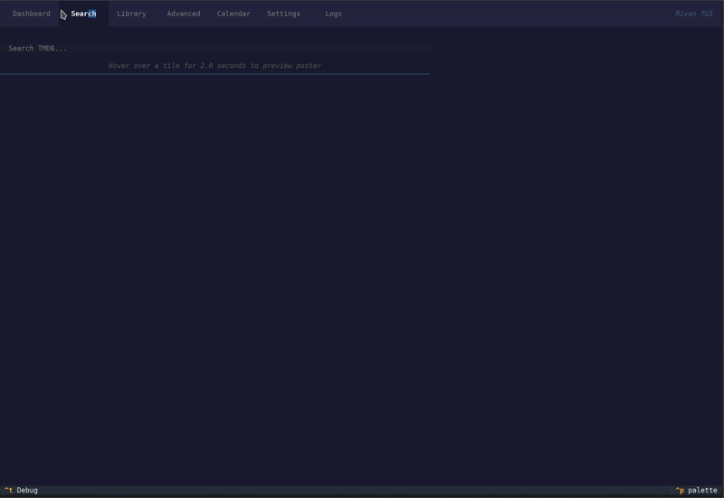
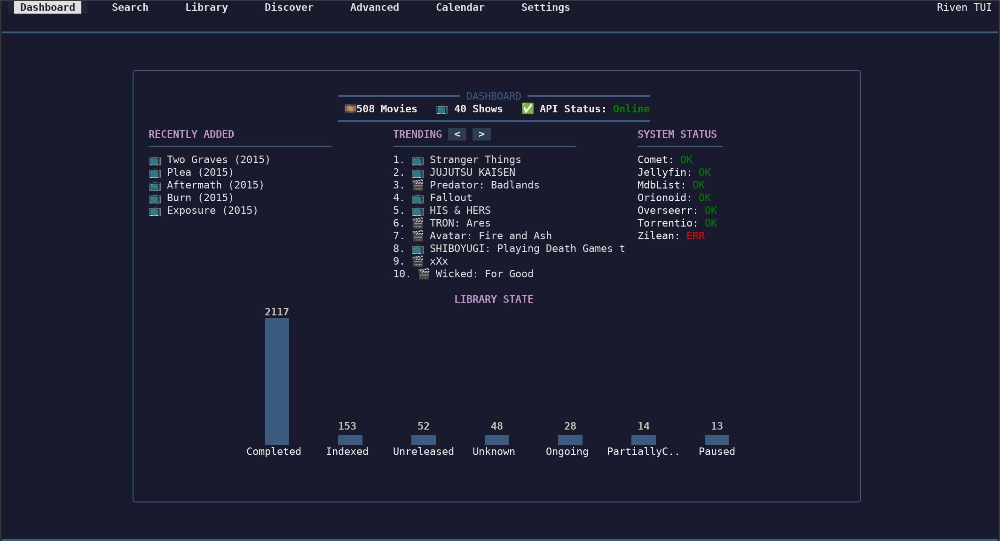
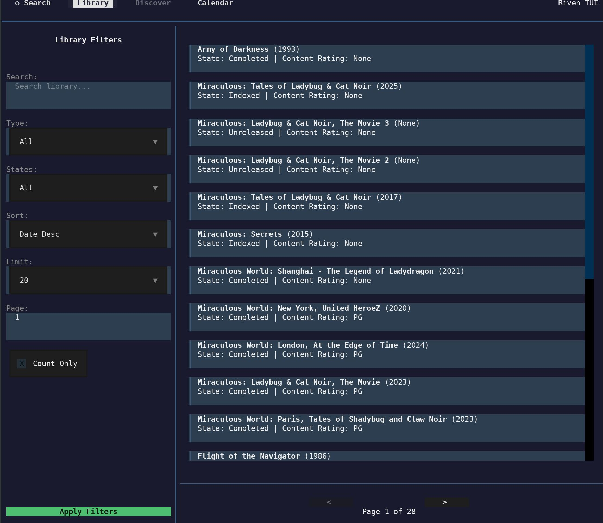
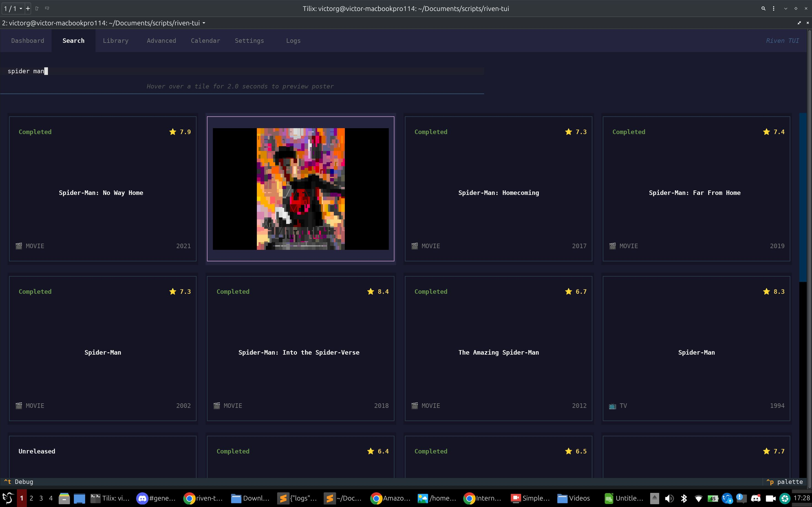
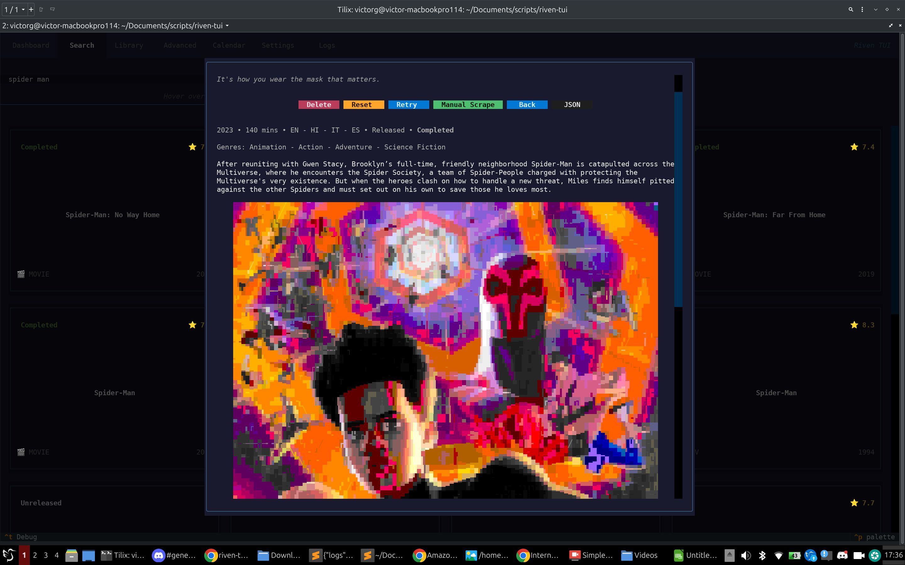
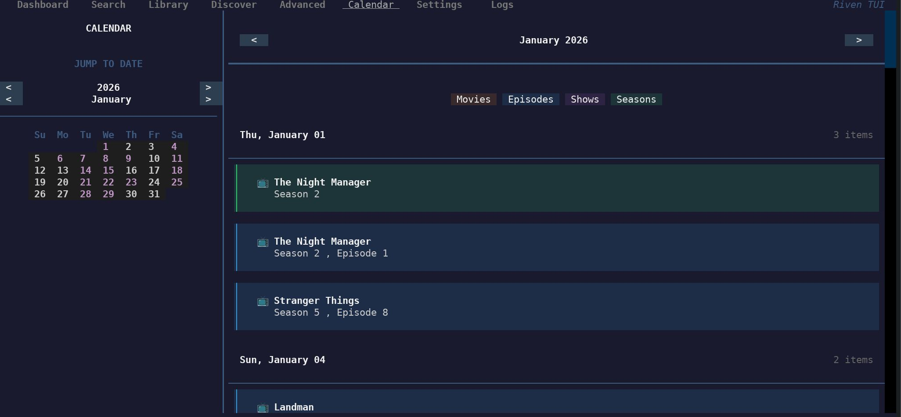
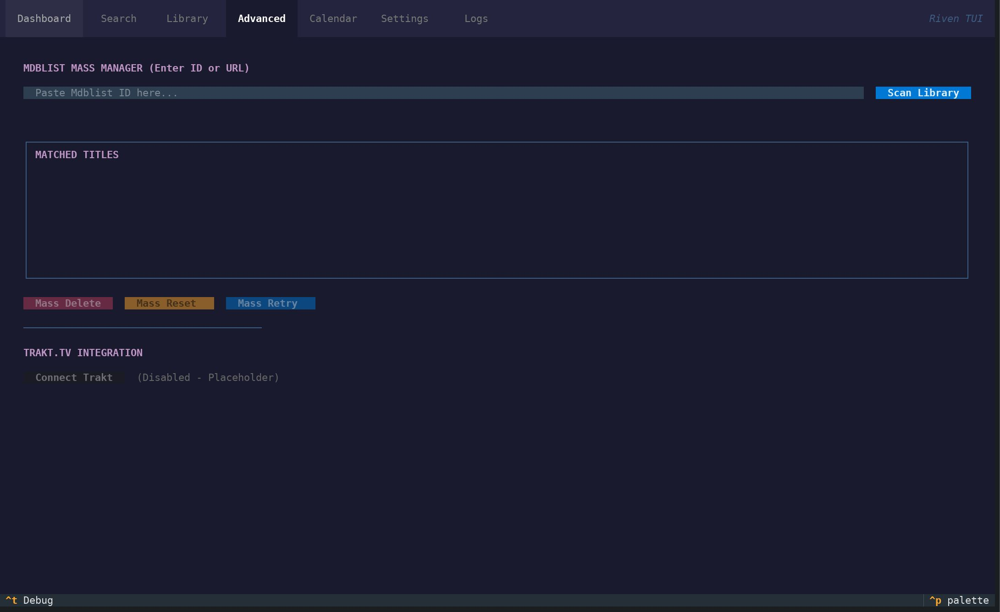
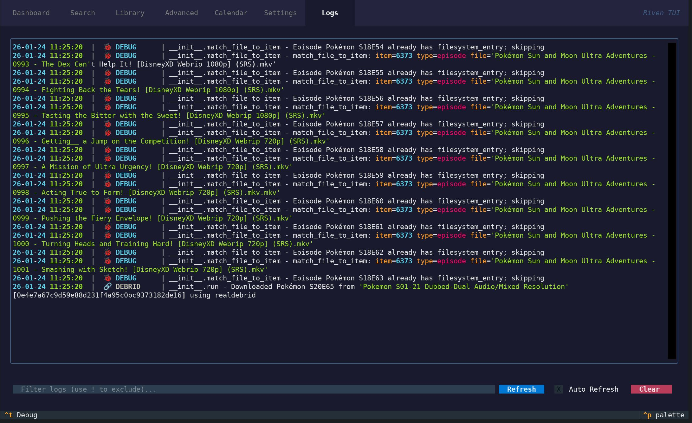
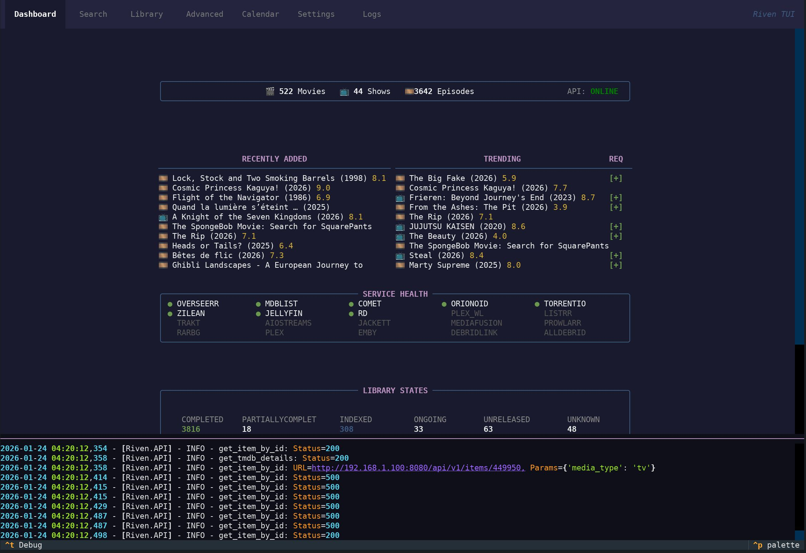

# Riven TUI

A high-performance terminal-based alternative to the Riven Web interface. 

Riven TUI turns your shell into a dedicated media kiosk, allowing you to discover, request, and maintain your entire collection with the speed and efficiency of a native terminal application.

<p align="center">
  
</p>

## ⚙️ Features & Core Functionality

- **Complete Web UI Replacement**: Manage your full Riven lifecycle entirely from the terminal.
- **The Media Wall (Search Grid)**: A robust 4-column layout designed for speed. Features intelligent coordinate-based hover logic to prevent flickering and automatically clears high-density images from memory when you move your mouse away.
- **Universal Multi-OS Support**: Native support for Debian/Ubuntu, Fedora, Arch, Alpine Linux, and macOS via a single installer.
- **Absolute Path Integrity**: Built for reliability in environments like unRAID or when using aliases. The app uses absolute path resolution to ensure `settings.json`, logs, and themes are found regardless of your current directory.
- **Advanced MDBList Management**: Probes MDBLists with real-time progress indicators, categorizing items into Roots, Seasons, Episodes, and Missing with throttled mass-add capabilities.
- **Seamless Auto-Updates**: One-click in-app updates that automatically handle git resets and dependency synchronizations.
- **Global Background Logs**: A background log collector toggled via **`Ctrl+L`** with a visual status indicator in the header.
- **Dynamic Theming**: Instant theme cycling with **`Ctrl+Y`**, supporting custom TCSS palettes located in the `themes/` directory.

## Installation

### Universal Setup (Recommended)
Automatically installs system dependencies (`chafa`, `git`, `python3-venv`), sets up the virtual environment, and configures a terminal alias.

```bash
curl -sSL https://raw.githubusercontent.com/subvhome/riven-tui/main/xinstall.sh | sh
```

### Manual Setup
1. Install **chafa** (system package) for image support.
2. `git clone https://github.com/subvhome/riven-tui.git`
3. `cd riven-tui && python3 -m venv .venv && source .venv/bin/activate`
4. `pip install -r requirements.txt`
5. `cp settings.json.example settings.json`
6. `python riven_tui.py`

## Screenshots

| Dashboard | Library |
| :---: | :---: |
|  |  |

| Search | Media Detail |
| :---: | :---: |
|  |  |

| Calendar | Advanced |
| :---: | :---: |
|  |  |

| Logs | Debug Window |
| :---: | :---: |
|  |  |

## Configuration

Configuration is stored in `settings.json`. The app uses absolute pathing to ensure this file is always loaded correctly from the installation directory:

- `riven_key`: Your Riven API key.
- `tmdb_bearer_token`: TMDB Read Access Token.
- `be_config`: Dictionary containing protocol, host, and port for your Riven backend.
- `theme`: The active theme name (e.g., `dracula`, `nord`, `default`).
- `chafa_max_width`: Maximum character width for rendered media posters.
- `request_timeout`: Global timeout for API requests.

---
Built with [Textual](https://github.com/Textualize/textual).
